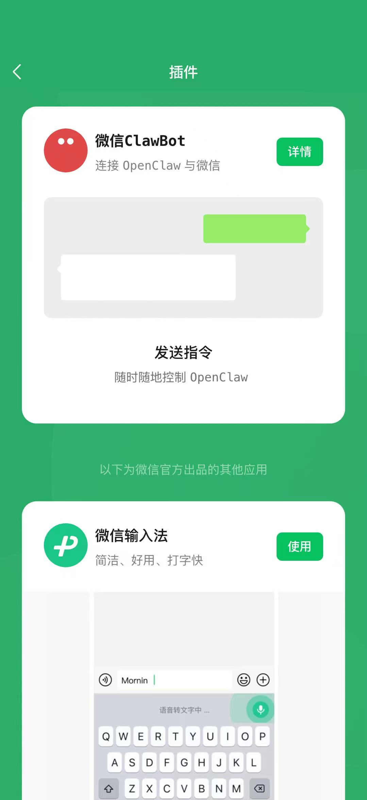
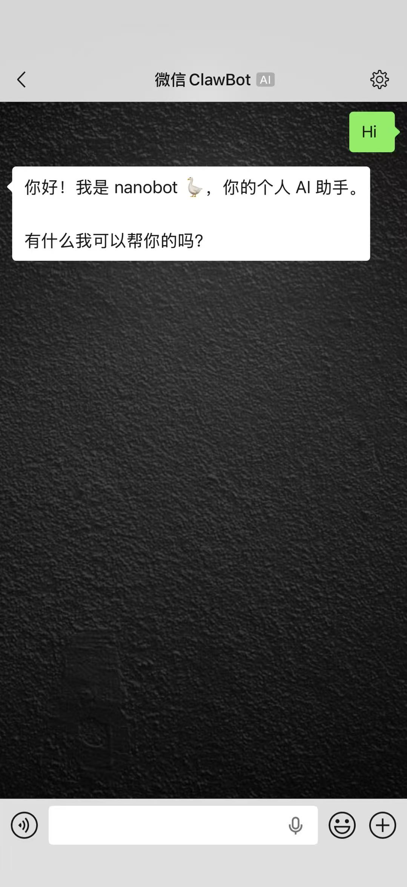

# nanobot-channel-weixin

Personal WeChat (微信) channel plugin for [nanobot](https://github.com/HKUDS/nanobot).

个人微信 Channel 插件，让你通过微信(客户端: 设置->插件，灰度中)与 nanobot AI 助手对话。



---

## Latest Updates / 最新动态

- **EN**: Supporting multiple accounts, per-account conversation isolation, and user ID matched re-login migration. We've also resolved image upload/download issues caused by changes on the official WeChat side. The plugin has been renamed to `weixin-community` to prevent any naming conflicts with the official `weixin` plugin.
- **CN**: 支持多账号登录、账号间对话隔离以及基于用户 ID 匹配的重登录迁移。同时，修复了因微信官方变动导致的图片上传与下载失败问题。插件已更名为 `weixin-community`，以避免与官方原生 `weixin` 插件产生命名冲突。

> [!NOTE]
> **EN**: While multiple WeChat accounts can be bound, `nanobot` currently uses a shared history file for memory. As a result, conversation isolation across multiple accounts may be imperfect when the LLM reads historical context.
> **CN**: 尽管支持绑定多个微信账号，但由于 `nanobot` 目前使用公共历史文件记录对话，大语言模型在读取历史背景时可能无法实现完美的账号间隔离。

---

## Important Notice / 重要通知

**EN:** 🎉 **Good news!** The official `nanobot` framework now natively supports the personal WeChat channel. Our community version has been renamed to `weixin-community` to coexist perfectly with the official one. You can choose to use either or both!

I will continue to maintain and update this plugin in my spare time. This repository remains a permanent part of the `nanobot` ecosystem, serving as a reference for plugin development.

**CN:** 🎉 **好消息！** `nanobot` 官方现已原生支持个人微信 Channel。为了完美兼容，本项目已更名为 `weixin-community`，可以与官方版本共存。你可以根据需要选择使用，或者两者并用！

我依然会在业余时间持续维护和更新本插件。这个仓库将永久保留，作为 `nanobot` 插件开发的一个参考案例，欢迎大家交流学习。

---

## Disclaimer / 免责声明

**EN:** This plugin is a Python implementation based on official documentation and the public npm package [`@tencent-weixin/openclaw-weixin`](https://www.npmjs.com/package/@tencent-weixin/openclaw-weixin). It communicates with the [iLink Bot API](https://ilinkai.weixin.qq.com) and is built from scratch for the nanobot ecosystem. This project is for educational, research, and personal use only. It is not affiliated with or endorsed by Tencent or WeChat.

**CN:** 本插件参考官方文档及公开的 npm 包 [`@tencent-weixin/openclaw-weixin`](https://www.npmjs.com/package/@tencent-weixin/openclaw-weixin) 进行了 Python 适配开发。它通过 [iLink Bot API](https://ilinkai.weixin.qq.com) 进行通信，完全为 nanobot 生态独立编写。本项目仅供学习、研究和个人使用，与腾讯或微信官方无关，亦未获其背书。

---

## How It Works / 工作原理

```
WeChat User ──► iLink Bot API (Tencent) ──► nanobot-channel-weixin ──► nanobot Agent
                   (long-poll)                    (Python)                (LLM)
```

- QR code scan to bind your WeChat identity / 扫码绑定微信身份
- Long-poll `getUpdates` to receive messages / 长轮询接收消息
- Reply via `sendMessage` API / 通过 API 回复消息
- Supports text, image, voice, file, and video / 支持文本、图片、语音、文件和视频

---

## Install / 安装

### If nanobot is installed via `uv tool` / 如果你已经通过 uv 安装过 nanobot

```bash
uv pip install git+https://github.com/alvis233/nanobot-channel-weixin.git \
  --python ~/.local/share/uv/tools/nanobot-ai/bin/python
```

Or install together with nanobot: / 或者也可以携带 nanobot-channel-weixin 重装 nanobot

```bash
uv tool install nanobot-ai \
  --with git+https://github.com/alvis233/nanobot-channel-weixin.git
```

### If nanobot is installed via `pip`

```bash
pip install git+https://github.com/alvis233/nanobot-channel-weixin.git
```

### From source / 从源码安装

```bash
git clone https://github.com/alvis233/nanobot-channel-weixin.git
cd nanobot-channel-weixin
pip install -e .
```

---

## Usage / 使用

### 1. Verify plugin is detected / 验证插件已识别

```bash
nanobot plugins list
```

You should see: / 你应该看到：

```
│ WeChat (Community)  │ plugin  │ no      │
```

### 2. Login with QR code / 扫码登录

```bash
# If installed via uv tool:
~/.local/share/uv/tools/nanobot-ai/bin/python -m nanobot_channel_weixin login

# If installed via pip:
nanobot-weixin login
```

Scan the QR code with your WeChat app to bind your account. Credentials are saved to `~/.nanobot/state/weixin-community/`.

用微信扫描终端中的二维码完成绑定，凭证自动保存到 `~/.nanobot/state/weixin-community/`。

### 3. Configure / 配置

The login command auto-enables the channel in `~/.nanobot/config.json`. You can also configure manually:

登录命令会自动在配置文件中启用频道，也可以手动配置：

```json
{
  "channels": {
    "weixin-community": {
      "enabled": true,
      "allowFrom": ["*"]
    }
  }
}
```

### 4. Start gateway / 启动网关

```bash
nanobot gateway
```

Now send a message to your WeChat bot — nanobot will reply!

现在通过微信给机器人发消息，nanobot 就会回复！



---

## Multiple Accounts / 多账户

Each `nanobot-weixin login` adds a new account entry. All accounts run concurrently.

每次执行 `nanobot-weixin login` 都会添加一个新的账号条目，所有账号并行运行。

```bash
nanobot-weixin login     # scan with WeChat account A
nanobot-weixin login     # scan with WeChat account B
nanobot-weixin status    # show all configured accounts
```

Each (account + peer user) pair has its own isolated AI conversation context — accounts never interfere with each other.

每个「微信账号 + 发消息用户」组合拥有独立的 AI 对话上下文，账号之间不会串台。

To remove an account: / 移除一个账户：

```bash
nanobot-weixin remove <account_id>
```

---

## Re-login / 重新登录

If your session expires, simply run the login command again:

如果登录态失效，重新执行登录命令即可：

```bash
~/.local/share/uv/tools/nanobot-ai/bin/python -m nanobot_channel_weixin login
```

---

## Security / 安全性

The iLink Bot API has built-in access control:

iLink Bot API 自带多层访问控制：

- Only users who actively message your bot can be seen / 只有主动给你发消息的用户才会出现
- Replies require a server-issued `context_token` — the bot cannot message arbitrary users / 回复需要服务端签发的 `context_token`，机器人无法主动骚扰他人
- `allowFrom: ["*"]` is safe in this context / 在此场景下设置 `allowFrom: ["*"]` 是安全的

---

## Project Structure / 项目结构

```
nanobot-channel-weixin/
├── pyproject.toml                      # Package config & entry points
└── nanobot_channel_weixin/
    ├── __init__.py                     # Exports WeixinChannel
    ├── channel.py                      # WeixinChannel(BaseChannel)
    ├── api.py                          # iLink Bot HTTP API client
    ├── auth.py                         # QR login & credential storage
    ├── cli.py                          # nanobot-weixin CLI
    └── __main__.py                     # python -m support
```

---

## Dependencies / 依赖

- [nanobot-ai](https://github.com/HKUDS/nanobot) — the nanobot framework
- [httpx](https://www.python-httpx.org/) — async HTTP client
- [cryptography](https://cryptography.io/) — AES-128-ECB for CDN media
- [qrcode](https://pypi.org/project/qrcode/) — terminal QR code display

---

## Acknowledgments / 致谢

- [nanobot](https://github.com/HKUDS/nanobot) by HKUDS — the ultra-lightweight AI assistant framework
- [`@tencent-weixin/openclaw-weixin`](https://www.npmjs.com/package/@tencent-weixin/openclaw-weixin) — the official OpenClaw WeChat plugin whose protocol was referenced

---

## License / 许可证

[MIT](LICENSE)
